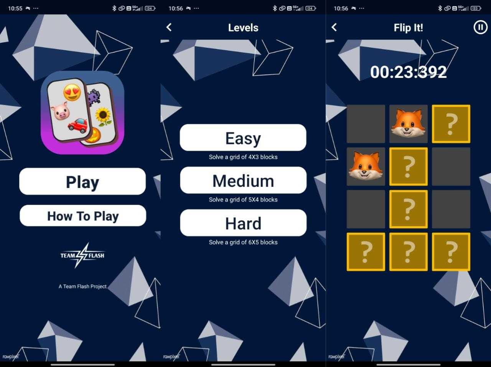
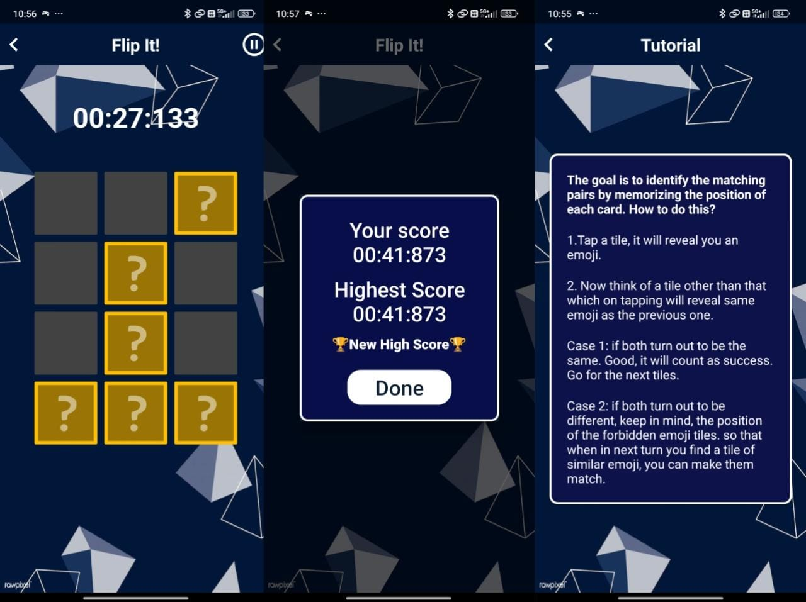

# 🎮 Flip It - Memory Tile Game

# Maintainer 
[Farhaan Shaikh](https://www.github.com/FSfarhaan)

## 📖 Description

**Flip It** is an engaging Android game developed in Java where players aim to identify matching pairs by memorizing the position of each card. The game tests and enhances your memory skills across different levels of difficulty. 

## ✨ Features

- 🧠 **Memory Challenge**: Flip tiles to reveal emojis and find matching pairs.
- 🎯 **Three Difficulty Levels**: Choose from Easy (4x3), Medium (5x4), and Hard (6x5) grids.
- ⏱️ **Timer**: Track the time taken to complete each round.
- 🏆 **High Score Tracking**: Compare your best time with the highest score.

## 📸 Screenshots

<!-- Add screenshots of your app here. Example: -->



## 🚀 Installation

1. **Clone the repository**:
    ```bash
    git clone https://github.com/CSI-DMCE-2024/FlipIt-Hacktoberfest2024.git
    ```
2. **Open the project in Android Studio**:
    - Open Android Studio
    - Click on `File -> Open`
    - Select the cloned repository folder

3. **Build and Run the app**:
    - Connect your Android device or start an emulator
    - Click on the `Run` button in Android Studio

## 🛠️ Usage

1. **Starting a Game**:
    - Open the app and select the difficulty level (Easy, Medium, or Hard).

2. **Playing the Game**:
    - Tap a tile to reveal an emoji.
    - Tap another tile to find the matching emoji.
      - **Case 1**: If both emojis match, it's a success! Move to the next tiles.
      - **Case 2**: If they don't match, remember their positions to match them later.

3. **Winning the Game**:
    - Once all pairs are matched, the timer stops and your score is recorded.
    - If your completion time is less than the highest score, it updates as the new high score.

## 🧩 Code Overview

### Main Components

- **GameActivity**: The main activity that handles the game logic and user interactions.
- **LevelAdapter**: The adapter class used to bind the game tiles to the `RecyclerView`.
- **SharedPreferences**: Used for storing and retrieving the highest scores.

### Game Logic

- **Tile Flipping**: Logic to handle the flipping of tiles and checking for matches.
- **Timer**: Manages the game timer to track the time taken to complete the game.
- **High Score**: Uses SharedPreferences to store and update the highest score.

## 🤝 Contributing

Contributions are welcome! Please create an issue or submit a pull request with your improvements.

## 📬 Contact

If you have any questions or suggestions, feel free to contact me at [farhaan8d@gmail.com](mailto:farhaan8d@gmail.com).
or connect with me on [LinkedIn](https://www.linkedin.com/in/farhaan-shaikh-422301252/)

---
